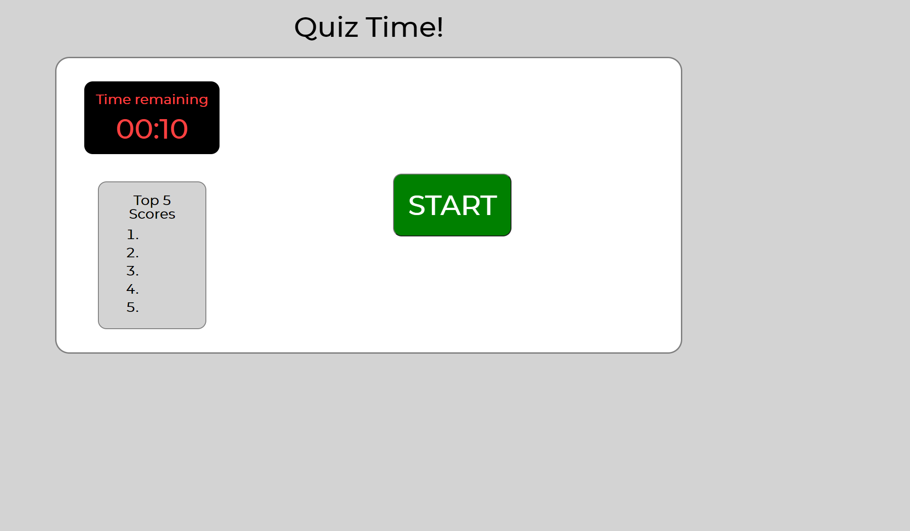
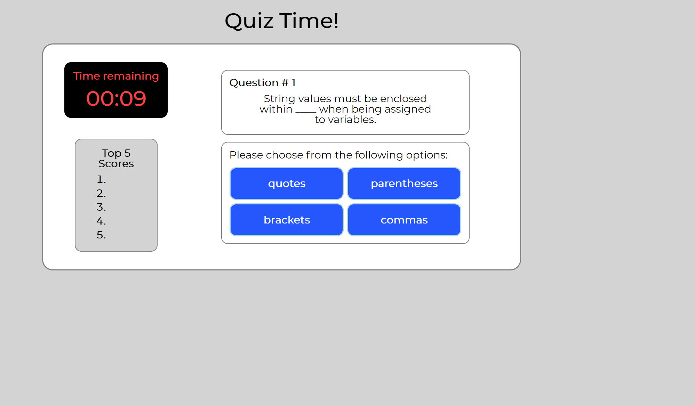

# WashU Bootcamp Homework, Week Four

## Table of Contents

I. Description
II. Project screenshot
III. Link to deployed page

## I. Description

Week four homework.  
Creating a quiz application using the provided mock-up and Acceptance Criteria.
Creating a repository on Github, and deploy the page to a live URL.
Acceptance Criteria include:
Clicking a start button to begin the quiz.
Using a timer for quiz duration.
Gaining points when a question is answered correctly.
Losing time when a question is answered incorrectly.
Game end is triggered by either time running out or all questions being answered.
Once game is over you can save your initials and score to the leaderboard.

## II. Project screenshot

## III. Link to deployed page

https://mikechampion.github.io/quiz-time/
